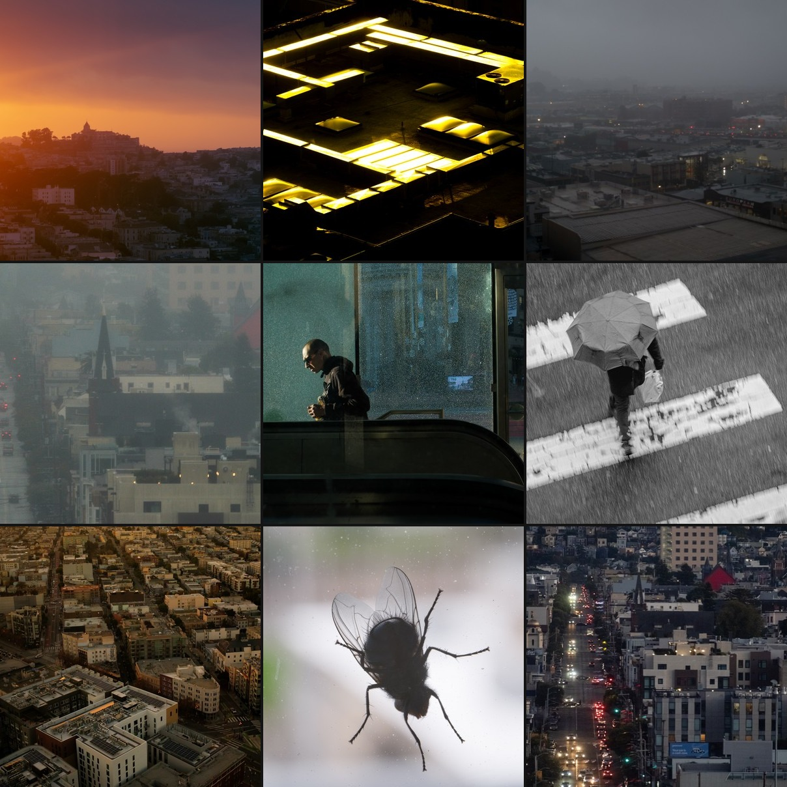

# Sigil Atlas

<p align="center">
  
</p>

<p align="center">
  <strong><a href="https://sigilatlas.fly.dev">Explore the live atlas</a></strong>
  &nbsp;&middot;&nbsp;
  <a href="docs/attention-language.md">Attention language reference</a>
</p>

---

## What is this

Sigil Atlas organizes a collection of photographs into a zoomable map based on visual similarity. Images are placed near the ones they most resemble — not by subject or category, but by what they look and feel like.

Two calibration interfaces let you teach the atlas your preferences:

- **Taste walk** — binary choices between image pairs along discovered contrast axes
- **Category filter** — a radar chart for dialing in subject-matter preferences (portrait, landscape, architecture, etc.)

Choices accumulate into a **sigil** — a sparse preference vector projected onto the map as a brightness overlay. The vocabulary comes from **[attention language](https://sigilsnotspells.com)**.

## How it works

Three kinds of visual similarity are fused together:

- **Semantic** — what things mean (a bridge, a face, a forest)
- **Structural** — how things are composed (symmetry, depth, negative space)
- **Textural** — what surfaces feel like (grain, sharpness, color temperature)

Where all three agree, the groupings are strong. Similar images cluster into neighborhoods; neighborhoods nest into larger regions. The result is a five-level hierarchy (960 nodes) you can zoom through.

## What you can do with it

### Navigate

Click any neighborhood to zoom in. Back arrow or Escape to go up one level. Home button to return to the root. Pan with WASD or drag. Scroll to zoom. The map layout is fixed — it does not rearrange.

### Taste walk

The balance-scale toolbar button starts a **taste walk**. Two image mosaics appear side by side — one from each extreme of a contrast axis. Pick left, right, or skip. Skipping records nothing.

### Category filter

The radar toolbar button opens a **category radar**. Pull handles outward to boost categories you want; leave others at center. The filter is multiplicative — it dims neighborhoods that don't match, without altering walk scores.

### Sigil overlay

The fingerprint toolbar button toggles the **taste overlay**. Neighborhoods aligned with your preferences brighten and grow; others dim and shrink. Unmeasured axes remain in **superposition** — not zero, just unmeasured.

The [attention language reference](docs/attention-language.md) explains the vocabulary and mechanics.

## Why

Photographs have properties that are easy to respond to but hard to talk about. Warm or cool. Dense or sparse. Still or restless. There is no standard vocabulary for these properties and no standard way to measure preference along them.

Sigil Atlas is an attempt to build both. Preference is recorded only from explicit choices — never inferred from viewing behavior. Unmeasured axes stay unmeasured. Correlated axes are disclosed, not hidden.

## Try it

**[Open the live atlas](https://sigilatlas.fly.dev)** — 250 photographs from San Francisco, organized into 960 neighborhoods across 5 levels.

## Run your own

```bash
python -m venv .venv && source .venv/bin/activate
pip install -e ".[dev]"

sigiltree index /path/to/images artifacts
sigiltree embed artifacts
sigiltree contrasts artifacts
sigiltree atlas artifacts --levels 4 --seed 42
sigiltree ride-stats artifacts
sigiltree serve artifacts --port 8888
```

Requires Python 3.11+ and PyTorch for the embedding step. Serving requires only `pillow`, `aiohttp`, `numpy`.

## Tests

```bash
pytest tests/ -v    # 205 tests
```

## Architecture

```
sigiltree/
  indexer.py          Corpus scanner, thumbnails
  db.py               SQLite catalog
  embeddings.py       CLIP, DINOv2, texture embeddings
  contrasts.py        Contrast discovery and selection
  atlas.py            Fused graph, clustering, treemap pyramid
  flythrough.py       Flow graph for lateral navigation
  arcade.py           Calibration arcade (category radar)
  walk.py             Binary taste walk (two-tile choices)
  ride_engine.py      Walk planning with drift policy
  ride_session.py     Walk state and sigil merging
  ride_stats.py       Precomputed z-summaries and correlations
  sigil_scoring.py    Per-node sigil + category gate scoring
  viewer_server.py    Server and all UI
  cli.py              CLI entry point
```

All artifacts are local files. No cloud dependencies. No telemetry.
